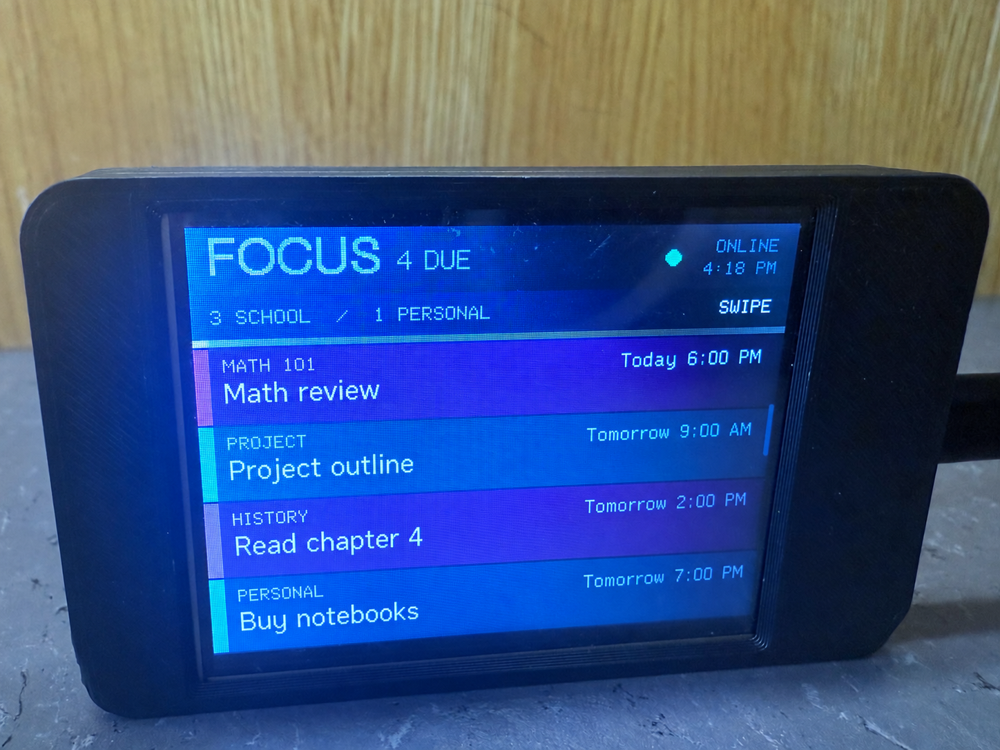
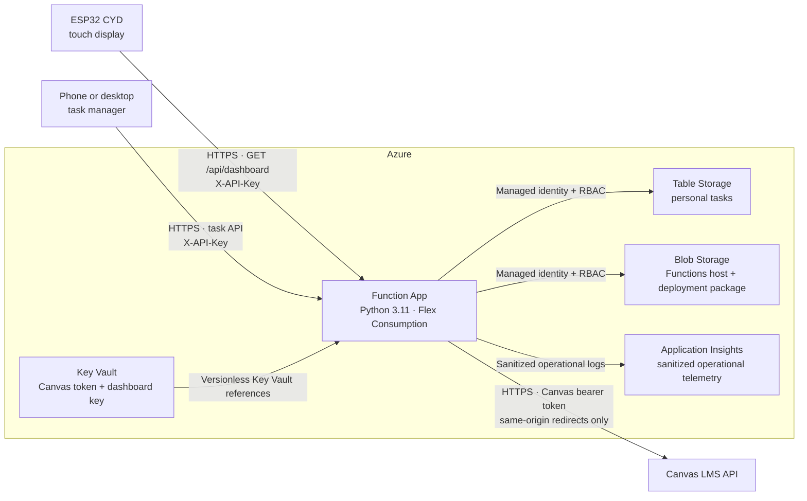

# CanvasYD

> An always-on Canvas LMS and personal-task dashboard for the ESP32-2432S028R
> “Cheap Yellow Display,” backed by a small Python service that can run locally
> or as a hardened Azure Function.

**ESP32 · Canvas LMS · Azure Functions · Python 3.11 · Azure Table Storage**

<p align="center">
  
</p>

CanvasYD turns a low-cost 320×240 touchscreen into a glanceable focus display.
It combines incomplete Canvas planner items with personal tasks, sorts everything
by due date, highlights urgent work, and refreshes automatically every 15 minutes.
The Canvas access token stays in the bridge; it is never copied to the ESP32.

## Contents

- [Highlights](#highlights)
- [Architecture](#architecture)
- [How data moves](#how-data-moves)
- [Repository layout](#repository-layout)
- [Local quick start](#local-quick-start)
- [Azure deployment](#azure-deployment)
- [Configure and build the CYD](#configure-and-build-the-cyd)
- [HTTP API](#http-api)
- [Configuration reference](#configuration-reference)
- [Security and privacy](#security-and-privacy)
- [Testing](#testing)
- [Troubleshooting](#troubleshooting)
- [Hardware reference](#hardware-reference)

## Highlights

### Display experience

- Full-screen landscape interface designed for the original 2.8-inch CYD.
- Swipe-to-scroll assignment cards using the onboard XPT2046 touch controller.
- School and personal counts, online state, last-refresh time, due labels, and an
  on-screen scroll indicator.
- Course-aware card colors and urgent styling for work due within 24 hours.
- Due-date ordering, readable date labels, and a maximum of 20 display items.
- Automatic Wi-Fi recovery every 15 seconds and data refresh every 15 minutes.

### Canvas integration

- Fetches active courses and incomplete Canvas Planner items.
- Follows Canvas pagination without allowing the bearer token to cross origins.
- Configurable look-ahead window; the default is 45 days.
- Five-minute in-memory Canvas cache to reduce API traffic and latency.
- Demo mode for testing the complete UI without a Canvas account.

### Personal tasks

- Responsive browser page for adding, listing, and completing personal tasks.
- Optional due dates with timezone-aware display labels.
- Local JSON persistence for the standalone bridge.
- Azure Table Storage persistence for the serverless deployment.
- Completed personal tasks disappear from the focus display.

### Two deployment modes

| Mode | Best for | Persistence | Device transport |
| --- | --- | --- | --- |
| Local Python bridge | Development and trusted home networks | Local `todos.json` | HTTP is an explicit development-only opt-in |
| Azure Functions | Always-on use | Azure Table Storage | HTTPS with certificate validation |

## Architecture



The local mode uses the same aggregation and web code but replaces Azure Table
Storage with a JSON file. This keeps development simple while preserving the
same dashboard response shape used by the firmware.

## How data moves

1. The bridge requests active courses and incomplete planner items from Canvas.
2. Canvas items are normalized and merged with incomplete personal tasks.
3. The bridge sorts the merged list, creates friendly due labels, marks urgent
   items, and returns the first 20 results.
4. The CYD downloads that JSON over HTTPS and renders it locally.
5. The browser task page calls relative, same-origin API routes and stores the
   dashboard key only in the current tab's `sessionStorage`.

### Data ownership and storage

| Data | Where it exists | Notes |
| --- | --- | --- |
| Wi-Fi credentials | Ignored `include/secrets.h` and flashed device | Never sent to the bridge or committed |
| Canvas token | Local ignored `.env`, or Azure Key Vault | Sent only to the configured HTTPS Canvas origin |
| Dashboard API key | Device, browser session, and Key Vault or local `.env` | Never accepted in a query string |
| Canvas assignments | Five-minute bridge memory cache and CYD response | Not persisted by CanvasYD |
| Personal tasks | Local ignored JSON file or Azure Table Storage | Protected by the dashboard API key and Azure RBAC |
| Operational telemetry | Azure Application Insights | Exception classes and request metadata only; no secrets or response bodies |

## Repository layout

```text
.
├── bridge/
│   ├── dashboard_server.py        # Local bridge, Canvas client, aggregation
│   ├── function_app.py            # Azure Functions HTTP routes
│   ├── table_todo_store.py        # Azure Table Storage task repository
│   ├── web/index.html             # Responsive personal-task page
│   ├── requirements.txt           # Pinned Azure Python dependencies
│   ├── host.json                  # Functions host/concurrency settings
│   └── local.settings.example.json
├── docs/images/
│   └── canvasy-dashboard-sanitized.png  # Privacy-safe project photo
├── include/
│   ├── azure_root_ca.h            # Public Azure trust anchor
│   └── secrets.example.h          # Sanitized firmware configuration template
├── src/main.cpp                   # ESP32 firmware and touch/display logic
├── tests/test_dashboard_server.py
└── platformio.ini                 # Pinned board platform and libraries
```

Private configuration, build products, virtual environments, Azurite state, and
generated editor files are excluded by `.gitignore` and `bridge/.funcignore`.

## Local quick start

### Prerequisites

- Python 3.11 or newer
- Git
- A modern browser
- PlatformIO only if you are building the firmware

### 1. Start in demo mode

From the repository root:

```powershell
Copy-Item bridge/.env.example bridge/.env
python bridge/dashboard_server.py
```

The example configuration uses `DEMO_MODE=1`. Open the LAN URL printed by the
server, enter the example dashboard key from `bridge/.env`, and try adding a
personal task.

### 2. Connect Canvas

Edit the ignored `bridge/.env` file:

```dotenv
CANVAS_BASE_URL=https://school.instructure.com
CANVAS_TOKEN=<your-personal-access-token>
DASHBOARD_API_KEY=<a-long-random-value>
DEMO_MODE=0
```

Create a token in Canvas under **Account → Settings → Approved Integrations →
New Access Token**. If personal tokens are disabled, ask the Canvas administrator
for an approved OAuth integration. Restart the bridge after changing settings.

> [!WARNING]
> The standalone bridge serves plain HTTP. Use it only for development on a
> trusted LAN. Azure mode is the recommended always-on deployment.

### Local Azure Functions development

Install [Azure Functions Core Tools](https://learn.microsoft.com/azure/azure-functions/functions-run-local)
and [Azurite](https://learn.microsoft.com/azure/storage/common/storage-use-azurite),
then run:

```powershell
python -m venv bridge/.venv
.\bridge\.venv\Scripts\Activate.ps1
python -m pip install -r bridge/requirements.txt
Copy-Item bridge/local.settings.example.json bridge/local.settings.json
Set-Location bridge
func start
```

`local.settings.json` is ignored and must never be committed.

## Azure deployment

### Cloud resources

| Resource | Purpose | Recommended security posture |
| --- | --- | --- |
| Function App | Python v2 HTTP application | Linux, Python 3.11, Flex Consumption, HTTPS-only |
| Storage account | Host state, deployment package, and personal-task table | TLS 1.2, secure transfer, no anonymous blobs, Shared Key disabled after identity migration |
| Key Vault | Canvas token and dashboard API key | RBAC, purge protection, versionless references |
| Application Insights | Availability and runtime diagnostics | Sanitized logs; no application payload logging |

### Identity and RBAC

Enable a system-assigned managed identity on the Function App and grant only:

| Role | Scope | Why it is needed |
| --- | --- | --- |
| `Storage Blob Data Owner` | Storage account | Functions host storage and identity-based package deployment |
| `Storage Table Data Contributor` | Storage account | Create, read, and update personal tasks |
| `Key Vault Secrets User` | Project Key Vault | Resolve the two application secret references |

No production storage connection string is required.

### Function settings

Configure these under **Function App → Settings → Environment variables**:

| Setting | Example or purpose |
| --- | --- |
| `CANVAS_BASE_URL` | `https://school.instructure.com` |
| `CANVAS_TOKEN` | Versionless Key Vault reference to `canvas-token` |
| `DASHBOARD_API_KEY` | Versionless Key Vault reference to `dashboard-api-key` |
| `DASHBOARD_TIMEZONE` | IANA zone such as `America/Denver` |
| `CANVAS_CACHE_SECONDS` | `300` |
| `CANVAS_LOOKAHEAD_DAYS` | `45` |
| `TODO_STORAGE_ENDPOINT` | `https://<account>.table.core.windows.net` |
| `TODO_TABLE_NAME` | `Todos` |
| `DEMO_MODE` | `0` for Canvas, `1` for sample data |
| `AzureWebJobsStorage__accountName` | Storage account name |
| `AzureWebJobsStorage__credential` | `managedidentity` |

Versionless Key Vault references allow secret rotation without changing the app
setting:

```text
@Microsoft.KeyVault(SecretUri=https://<vault>.vault.azure.net/secrets/canvas-token)
@Microsoft.KeyVault(SecretUri=https://<vault>.vault.azure.net/secrets/dashboard-api-key)
```

### Deployment package storage

For Flex Consumption, configure the package container to use the Function's
system-assigned identity:

```powershell
az functionapp deployment config set `
  --name <function-app> `
  --resource-group <resource-group> `
  --deployment-storage-name <storage-account> `
  --deployment-storage-container-name <package-container> `
  --deployment-storage-auth-type SystemAssignedIdentity
```

### Platform hardening

```powershell
az functionapp update `
  --name <function-app> `
  --resource-group <resource-group> `
  --set httpsOnly=true

az functionapp config set `
  --name <function-app> `
  --resource-group <resource-group> `
  --min-tls-version 1.2 `
  --ftps-state Disabled

az storage account update `
  --name <storage-account> `
  --resource-group <resource-group> `
  --min-tls-version TLS1_2 `
  --https-only true `
  --allow-blob-public-access false `
  --allow-shared-key-access false
```

Disable Shared Key only after both Functions host storage and package deployment
have been verified with managed identity.

### Publish

```powershell
Set-Location bridge
func azure functionapp publish <function-app>
```

Core Tools performs a remote build against the Function's Python 3.11 runtime.

## Configure and build the CYD

### 1. Create the private firmware configuration

```powershell
Copy-Item include/secrets.example.h include/secrets.h
```

Edit only the ignored `include/secrets.h`:

```cpp
#define WIFI_SSID "your-network"
#define WIFI_PASSWORD "your-password"
#define DASHBOARD_URL "https://<function-app>.azurewebsites.net/api/dashboard"
#define DASHBOARD_API_KEY "the-same-dashboard-key"
```

Azure endpoints use the public DigiCert root in `include/azure_root_ca.h`. For a
different HTTPS provider, define `DASHBOARD_ROOT_CA` with that provider's trusted
root. The firmware refuses non-HTTPS dashboard URLs by default.

For short-lived local development on a trusted LAN only, explicitly add:

```cpp
#define ALLOW_INSECURE_HTTP 1
```

This opt-in transmits the dashboard key and data without transport encryption.

### 2. Build

Use **PlatformIO: Build** in VS Code or run:

```powershell
pio run -e cyd
```

The application binary is written to `.pio/build/cyd/firmware.bin`.

### 3. Install

- To preserve an existing [Launcher](https://github.com/bmorcelli/Launcher)
  installation, install `firmware.bin` through Launcher's WUI or SD-card flow.
- To intentionally replace Launcher, connect the CYD over USB and run
  `pio run -e cyd --target upload`.
- Open serial diagnostics with `pio device monitor --baud 115200`.

## HTTP API

All data routes require `X-API-Key`. The page shell and minimal health probe are
public so a browser and Azure health checks can load them safely.

| Method | Route | Authentication | Purpose |
| --- | --- | --- | --- |
| `GET` | `/api/home` | None to load; key entered in page | Personal-task UI |
| `GET` | `/api/health` | None | Returns only `{"ok": true}` |
| `GET` | `/api/dashboard` | `X-API-Key` | Merged, display-ready dashboard |
| `GET` | `/api/todos` | `X-API-Key` | List personal tasks |
| `POST` | `/api/todos` | `X-API-Key` | Create a personal task |
| `POST` | `/api/todos/{id}/toggle` | `X-API-Key` | Toggle completion |

Example dashboard response:

```json
{
  "generated_at": "2030-01-01T18:00:00+00:00",
  "updated_label": "11:00 AM",
  "counts": { "canvas": 2, "personal": 1 },
  "items": [
    {
      "id": "example-1",
      "source": "canvas",
      "title": "Weekly preparation",
      "context": "COURSE 101",
      "due_at": "2030-01-02T06:59:00Z",
      "due_label": "Tomorrow 11:59 PM",
      "urgent": true,
      "url": ""
    }
  ]
}
```

## Configuration reference

| Variable | Default | Used by | Description |
| --- | --- | --- | --- |
| `CANVAS_BASE_URL` | Empty | Both bridges | HTTPS Canvas tenant base URL |
| `CANVAS_TOKEN` | Empty | Both bridges | Canvas bearer token; required outside demo mode |
| `DASHBOARD_API_KEY` | Empty | Both bridges | Shared API key; service fails closed when absent |
| `DASHBOARD_TIMEZONE` | `America/Denver` | Both bridges | IANA timezone for due labels |
| `CANVAS_CACHE_SECONDS` | `300` | Both bridges | Canvas result cache duration |
| `CANVAS_LOOKAHEAD_DAYS` | `45` | Both bridges | Planner query horizon |
| `DEMO_MODE` | `0` | Both bridges | Use deterministic sample items when enabled |
| `DASHBOARD_HOST` | `0.0.0.0` | Local bridge | Local listen address |
| `DASHBOARD_PORT` | `8787` | Local bridge | Local listen port |
| `TODO_STORAGE_ENDPOINT` | Empty | Azure | Table service URL for managed identity |
| `TODO_STORAGE_CONNECTION_STRING` | Empty | Local Functions | Azurite/development fallback only |
| `TODO_TABLE_NAME` | `Todos` | Azure | Personal-task table name |
| `AZURE_CLIENT_ID` | Empty | Azure | Optional user-assigned identity client ID |

## Security and privacy

### Implemented controls

- **Transport security:** Azure HTTPS-only, TLS 1.2 minimum, FTPS disabled, and
  firmware certificate validation. Plain HTTP is blocked by default.
- **Secret isolation:** Canvas token stays in the bridge. Production secrets use
  Key Vault references and are not stored in source control or app packages.
- **Identity-first Azure access:** Functions host storage, deployment packages,
  Table Storage, and Key Vault use managed identity with RBAC. Storage Shared
  Key and anonymous blob access can remain disabled.
- **API authentication:** Constant-time API-key comparison, fail-closed behavior,
  and bounded authentication-failure throttling.
- **Canvas token containment:** Canvas must use HTTPS. Pagination and redirects
  are rejected if they attempt to change origin.
- **Browser isolation:** Per-response CSP nonces, `connect-src 'self'`, no remote
  scripts, API key in tab-scoped session storage, HTML escaping, and anti-framing,
  no-sniff, referrer, permissions, and no-store headers.
- **Input boundaries:** 16 KiB local request limit, 160-character task titles,
  ISO-8601 due-date validation, parameterized Table queries, and escaped IDs.
- **Minimal exposure:** Health returns only a boolean, serial output excludes
  response bodies, and production logs record exception classes rather than raw
  errors, secrets, or application payloads.
- **Supply-chain hygiene:** Python and PlatformIO dependencies are version-pinned;
  generated artifacts, credentials, state files, and private editor metadata are
  ignored by Git and Functions deployment packaging.

### Important limitations

- The dashboard key is a bearer credential stored in device firmware. Someone
  with physical access and flash-reading capability may be able to recover it.
  Rotate the key if a device is lost or firmware is shared.
- Authentication throttling is in-memory and per Function instance. It is a
  lightweight control, not a replacement for an API gateway or WAF in a larger
  deployment.
- The Function endpoint is public so the CYD can reach it. Private endpoints and
  VNet integration can further restrict Storage and Key Vault for higher-security
  environments.
- A custom HTTPS provider may require maintaining a different trusted root on the
  ESP32. Plan to update the firmware before that root expires or changes.

## Testing

### Bridge tests

```powershell
python -m unittest discover -s tests -v
python -m pip check
```

The test suite covers aggregation, completed-task filtering, API authentication,
fail-closed configuration, HTTPS/same-origin Canvas behavior, timestamp parsing,
and CSP nonce generation.

### Firmware build

```powershell
pio run -e cyd
```

### Local smoke test

```powershell
Invoke-RestMethod http://localhost:8787/health
```

### Azure smoke test

```powershell
$headers = @{ "X-API-Key" = "<dashboard-api-key>" }
Invoke-RestMethod "https://<function-app>.azurewebsites.net/api/dashboard" -Headers $headers
```

## Troubleshooting

| Symptom | Check |
| --- | --- |
| Blank display | Confirm the board is the original 2.8-inch ESP32-2432S028R and review serial output |
| Wrong colors | Swap `TFT_INVERSION_ON` for `TFT_INVERSION_OFF` in `platformio.ini` |
| Touch does not scroll | Verify the XPT2046 pinout below; similar CYD variants use different controllers |
| `Refusing non-HTTPS dashboard URL` | Use Azure HTTPS, or explicitly enable insecure HTTP only on a trusted development LAN |
| Azure returns `401` | Confirm the device/browser key matches the Key Vault-backed Function setting |
| Azure returns `429` | Wait for the authentication-failure window to clear and check the configured key |
| Azure returns `503` | Verify Table endpoint, managed-identity roles, Key Vault reference status, and Canvas settings |
| Canvas returns `401` | Recreate the Canvas token and confirm the Canvas tenant URL |
| Assignment is missing | Confirm it appears in Canvas Planner and falls inside the configured look-ahead window |
| Local port `7071` is busy | Stop the other Functions host or start with `func start --port <port>` |
| Deployment reports Python mismatch | Use a Python 3.11 environment locally; remote build still targets the configured Azure runtime |

## Hardware reference

Target: original **ESP32-2432S028R**, 2.8-inch resistive-touch CYD with an
ILI9341-compatible 320×240 display.

### Display pins

| Signal | GPIO |
| --- | ---: |
| TFT MOSI | 13 |
| TFT MISO | 12 |
| TFT clock | 14 |
| TFT chip select | 15 |
| TFT data/command | 2 |
| Backlight | 21 |

### XPT2046 touch pins

| Signal | GPIO |
| --- | ---: |
| Touch MOSI | 32 |
| Touch MISO | 39 |
| Touch clock | 25 |
| Touch chip select | 33 |
| Touch IRQ | 36 |

Similar-looking CYD models can use different displays, touch controllers, and
pin mappings. Confirm the board revision before changing the firmware settings.

---

CanvasYD is intentionally small: one embedded client, one Python bridge, and a
minimal Azure data layer. The result is an always-visible focus tool that is easy
to understand, inexpensive to run, and practical to operate securely.
